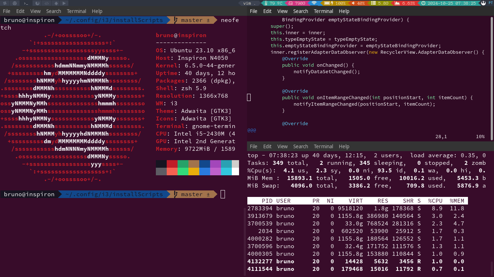
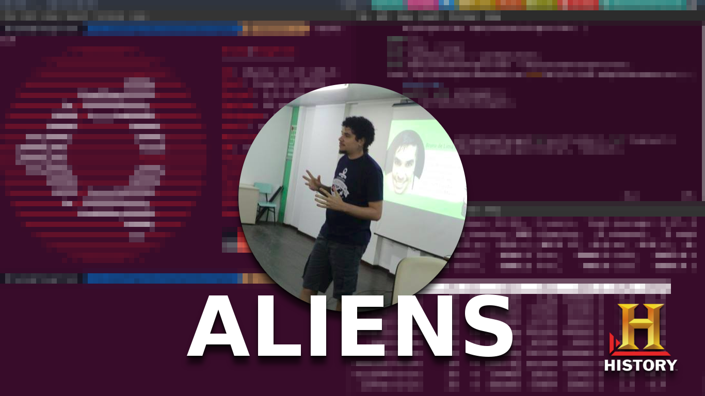

# My i3wm configuration



# Things to install
To make it work, we need to install some tools.

## The Window Manager
Well, everything is setup inside the i3wm, so it's required.

```bash
    sudo apt-get install i3wm
```

## The Background tool
Used to change the background each minute, if you don't want this, remove it on `config` file.
```bash
    sudo apt-get install feh
```

## Monitor tool
This tool can be used to change the monitor\\display.
It's just a wrapper for `xrandr`, may help you to get used with this.
```bash
    sudo apt-get install arandr
```

## ~~Custom bar / LemonBar~~
I'm not using this, but if you want, you can install a custom bar.
```bash
    sudo apt-get install libxcb-xinerama0-dev
    sudo apt-get install libxcb-randr0-dev
    git clone https://github.com/LemonBoy/bar.git lemonbar
    cd lemonbar
    make
    sudo make install
```

## Bluetooth utils
`bluetooth-wizard`

## Install font awesome
This is used on the **i3bar**, to add custom icons, if you don't want custom icon on the bar remove it from the `config` file.
```bash
    mkdir ~/.fonts
    wget https://github.com/FortAwesome/Font-Awesome/raw/master/fonts/fontawesome-webfont.ttf
    mv fontawesome-webfont.ttf ~/.fonts/
```

## File Explorer
If you're not used with terminal to explore file, you can use **Thunar** to do so.
It's pretty similar to *gnome file version*.
```bash
    sudo apt-get install thunar
    sudo apt-get install gnome-icon-theme-full
```

## FireFox Theme
Just a firefox theme
https://github.com/horst3180/arc-firefox-theme

## GTK Appearance tool
This tool changes all GTK applications appearance, to apply this, you need to do it manually.
```bash
    sudo apt-get install lxappearance
```
### GTK Theme
```bash
    wget http://download.opensuse.org/repositories/home:Horst3180/xUbuntu_15.10/Release.key
    sudo apt-key add - < Release.key
    sudo sh -c "echo 'deb http://download.opensuse.org/repositories/home:/Horst3180/xUbuntu_15.10/ /' >>  /etc/apt/sources.list.d/arc-theme.list"
    sudo apt-get update
    sudo apt-get install arc-theme
```
### GTK Icons
```bash
    sudo add-apt-repository ppa:moka/stable
    sudo apt-get update && sudo apt-get install moka-icon-theme
```

## Better font rendering
```bash
    sudo add-apt-repository ppa:no1wantdthisname/ppa
    sudo apt-get update
    sudo apt-get upgrade
    sudo apt-get install fontconfig-infinality
```
## Install Yosemite SanFrancisco Font
Look on the link on the end of this file to know how to use it, cuz it's a manual task.
```bash
    wget https://github.com/supermarin/YosemiteSanFranciscoFont/archive/master.zip
    unzip YosemiteSanFranciscoFont-master.zip
    mv YosemiteSanFranciscoFont-master/*.ttf ~/.fonts/
    rm -rd YosemiteSanFranciscoFont-master
```

## Custom Lockscreen
If you want to change the LockScreen look the links.
https://www.reddit.com/r/unixporn/comments/3358vu/i3lock_unixpornworthy_lock_screen
https://git.fleshless.org/misc/tree/i3lock-extra

## To take printscreen and pixelate it, needed to use custom lockscreen
```bash
    sudo apt-get install scrot imagemagick
```

## A tutorial
* [i3wm: Jump Start (1/3)](https://www.youtube.com/watch?v=j1I63wGcvU4)
* [i3wm: Configuration (2/3)](https://www.youtube.com/watch?v=8-S0cWnLBKg)
* [i3wm: How To "Rice" Your Desktop (3/3)](https://www.youtube.com/watch?v=ARKIwOlazKI)
